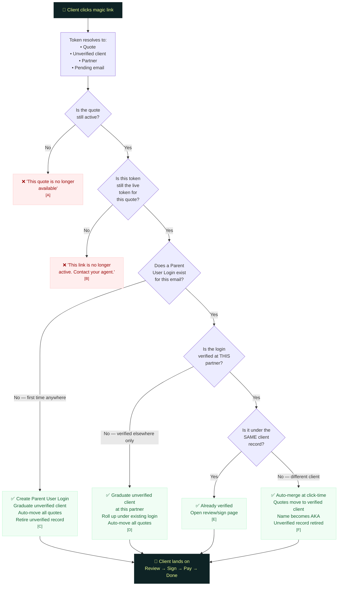

# Magic Link Click Resolution

> What happens when the client clicks a magic link

## Annotations

| Ref | Detail |
|-----|--------|
| **[A]** | Quote expired, cancelled, or replaced. The link had no arbitrary expiry — validity is tied to the quote. Nothing to clean up since no state was created. |
| **[B]** | Agent changed the email after sending, which invalidated this token. A newer token exists for this quote. The client should contact their agent for a new link. |
| **[C]** | **First verification anywhere.** Login created on click, not on send. All quotes auto-move from the unverified client — including quotes without their own tokens. This is the simple auto-move approach; see "Known Risks: lazy agent" for the edge case where multiple people's quotes sit under one client. |
| **[D]** | **Cross-partner roll-up.** The email was verified at a different partner (e.g., verified at Agency A, now clicking from Agency B). A new verified partner client is created at this partner and linked to the existing Parent User Login. Per-partner re-verification is satisfied. No merge of client records. |
| **[E]** | **Returning verified client.** The client already verified at this partner with this email. The click just authenticates them (the link is the auth) and opens the review page. No verification step needed. Applies to: subsequent links for same client, or links sent after the client is already verified. |
| **[F]** | **Click-time auto-merge.** The email is verified at this partner, but under a *different* client record. This happens when the agent created multiple unverified clients (e.g., "John Doe" and "J. Doe") and sent links for both to the same email. The first verification created the login under "John Doe"; now J. Doe's quotes merge into John Doe's verified record. The name "J. Doe" becomes an AKA. No client-facing prompt — the merge is invisible to the client. |
