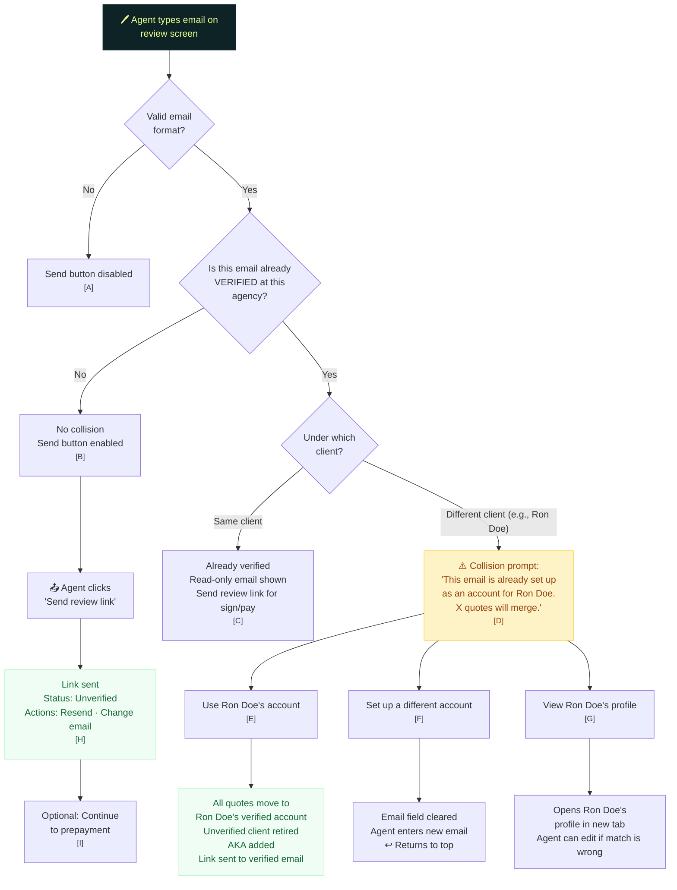

# Agent Review Screen — Email Entry

> What happens when the agent enters an email on the review screen for an unverified client

## Annotations

| Ref | Detail |
|-----|--------|
| **[A]** | Basic client-side validation. Also silently trims whitespace, lowercases, and strips `mailto:` prefixes from pasted text. |
| **[B]** | **No cross-partner check.** The system does NOT check whether this email is verified at a different agency. Agent can't see cross-agency data (Rule 10). If the email is verified elsewhere, the cross-partner roll-up happens silently at click-time (Path D in the click diagram). |
| **[C]** | Edge case: agent somehow arrived at the review screen with a client who's already verified. Email is pre-filled and read-only. No email entry needed. |
| **[D]** | **Same-agency collision (E2).** The prompt explicitly states the merge impact: the number of active quotes that will move. This is the agent's decision point — they can merge, try a different email, or inspect the other client's profile. |
| **[E]** | **Agent-initiated merge.** ALL quotes from the current unverified client move to the verified client — not just the one the agent is working on. The agent confirmed the merge, which is the authorization. The unverified client record is retired and the name becomes an AKA on the verified account. |
| **[F]** | Email field clears. Agent enters a different email. The flow restarts from the top — the new email goes through the same collision check. |
| **[G]** | Opens in a new tab so the agent doesn't lose their place in the quote flow. Useful when the agent believes the match is wrong — they can edit Ron Doe's profile (e.g., change Ron's email to free up this one) and then return. |
| **[H]** | **Post-send state.** Only two verification statuses are visible: Unverified and Verified. No "sent," "delivered," "bounced," etc. Resend is silently rate-limited. Change email silently invalidates the previous token. One live token per quote at any time. |
| **[I]** | **Prepayment is a separate, optional step.** Has no bearing on verification. If the agent prepays, the client won't see a payment step. If the client never verifies, prepayment refund follows billing rules (separate from this spec). |
