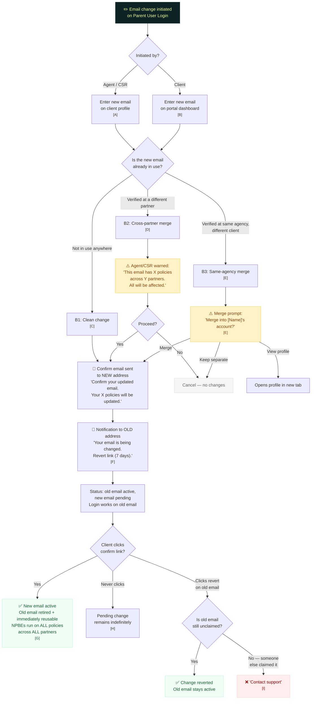

# Email Change Flow (Section B)

> What happens when anyone (agent, CSR, or client) changes the email on a verified account

## Annotations

| Ref | Detail |
|-----|--------|
| **[A]** | **Agent/CSR edit.** Only the new email requires confirmation (the client clicks the confirm link). The old email gets a notification with a revert link as a safety net. CSRs can initiate this from the parent account section in Halo. Agents can initiate from their partner's client profile. |
| **[B]** | **Client-initiated edit (B4).** Same flow, but only the new email requires confirmation. The client is already authenticated via login, so verifying the old email again is redundant. The old-email notification with revert link provides the safety net. |
| **[C]** | **B1: Clean change.** Confirmation copy: "Confirm your updated email address. This will be the email used to sign into your account. Your X active policies will be updated to reflect this new contact email." No mention of partner names or named insured unless it's a merge. |
| **[D]** | **B2: Cross-partner merge.** The agent/CSR MUST be warned that this affects policies outside their agency: "This email is associated with an account that has X active policies across Y partners. Updating the email will affect all of them." On confirm, verified clients consolidate under the existing login. |
| **[E]** | **B3: Same-agency merge.** Merge prompt offers three options. If merged: full consolidation of all partner clients, policies, AKAs. Merge confirmation adds: "Policy documents will still show [original name] as the named insured. To change that, contact service." Name-change messaging only appears in merge scenarios. |
| **[F]** | **Old email notification.** Revert link valid 7 days. Does a live check at click time — if someone else has claimed the old email since it was retired, the revert fails gracefully with "contact support." No buffer period on retired emails; they're immediately reusable. |
| **[G]** | **NPBEs.** Contact email endorsements run on every active policy in the entire stack of partner clients under this Parent User Login, across all partners. Follows the same backend behavior as mailing address NPBEs. |
| **[H]** | **Stale pending change.** If the client never clicks the confirm link, the old email stays active indefinitely. If a new email change is initiated while one is pending, the pending change is replaced. |
| **[I]** | **Revert failure.** Extremely unlikely — requires someone else to claim the exact same email within 7 days of it being freed. Fails gracefully. Support can resolve manually. |
