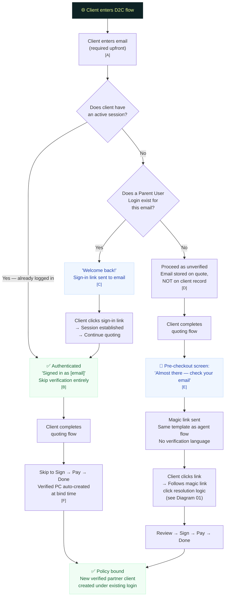

# D2C Flow

> Client-initiated quoting and checkout from any partner's D2C experience

## Annotations

| Ref | Detail |
|-----|--------|
| **[A]** | **Email required upfront in D2C.** Unlike agent flows where email is deferred to the review screen, D2C asks for email at the start. This serves dual purposes: recognizing returning clients and storing a contact point for the quote. |
| **[B]** | **Logged-in = verified for D2C.** An active session from ANY previous verification (any partner, any flow) satisfies verification. No re-verification needed. Per-partner re-verification only applies in agent-initiated flows. At bind time, a verified partner client is auto-created under the current partner and linked to the existing Parent User Login. |
| **[C]** | **Recognized but not logged in.** Session expired since last visit. The sign-in link is NOT re-verification — it's just logging in. Clicking it restores the session; the client continues quoting as authenticated. |
| **[D]** | **New client.** Email stored on the quote (same pattern as agent flow — email on the link/quote, not on the client record). Client proceeds through quoting as unverified. Verification happens at checkout via magic link. |
| **[E]** | **Pre-checkout verification screen.** Only shown to unverified clients. Explains the email will be used for their online account. Sends the same email template as agent flows — "Your insurance for [Address] is ready to review." Actions: Resend, Change email. If the client changes email, old link invalidated. |
| **[F]** | **Authenticated checkout.** No verification screen, no magic link. Client goes straight to sign + pay. The verified partner client is created at bind time as a side effect — the client never sees this. Works regardless of which partner's D2C flow they came through. |

### Lender-as-Client Risk

When a lender goes through D2C on behalf of a client:
- If they enter the **client's real email** → magic link goes to the client's inbox. Lender can't complete checkout without client involvement. System works correctly.
- If they enter **their own email** → policy binds under the lender's email. Named insured won't match account holder. Detected via post-launch monitoring (email domain match, NI mismatch).
- **Safeguard:** Passive monitoring flags. No hard block in v1.
